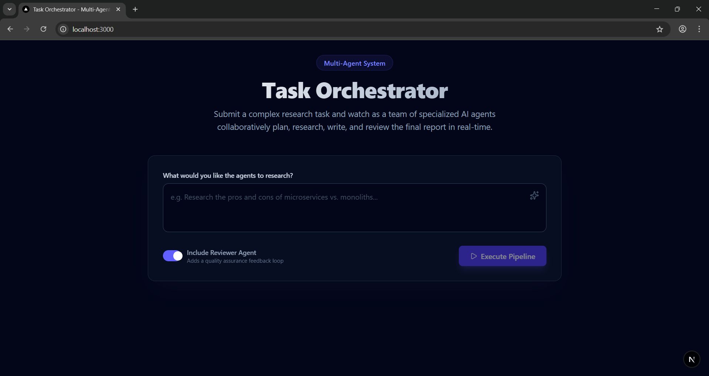
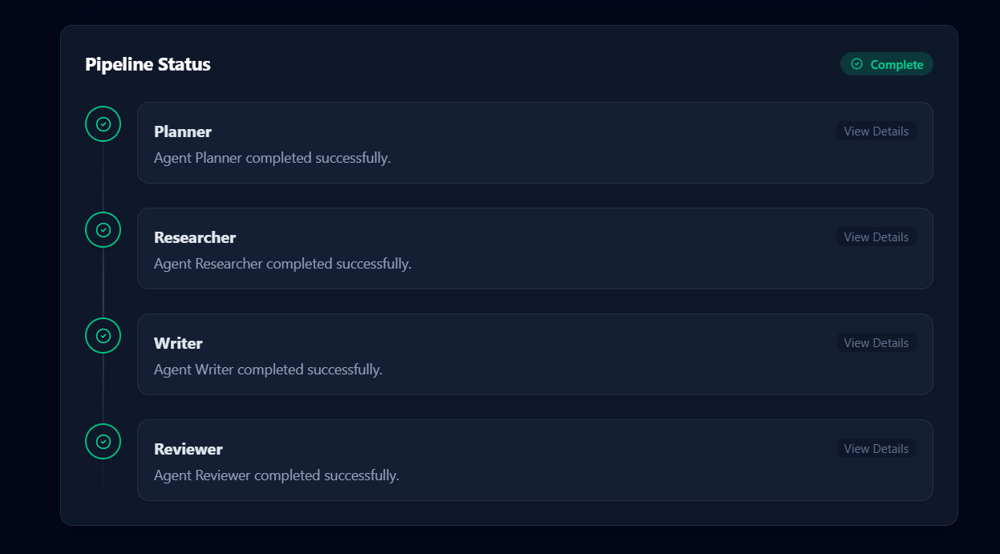
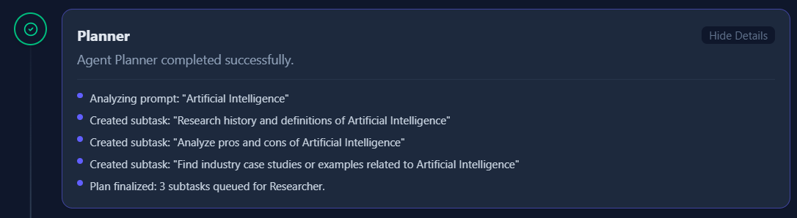
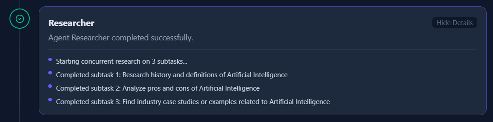
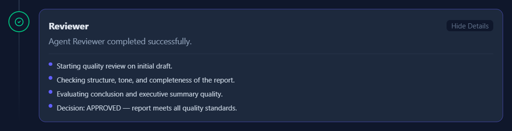
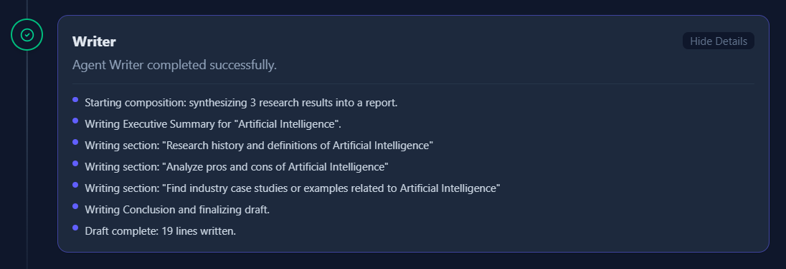
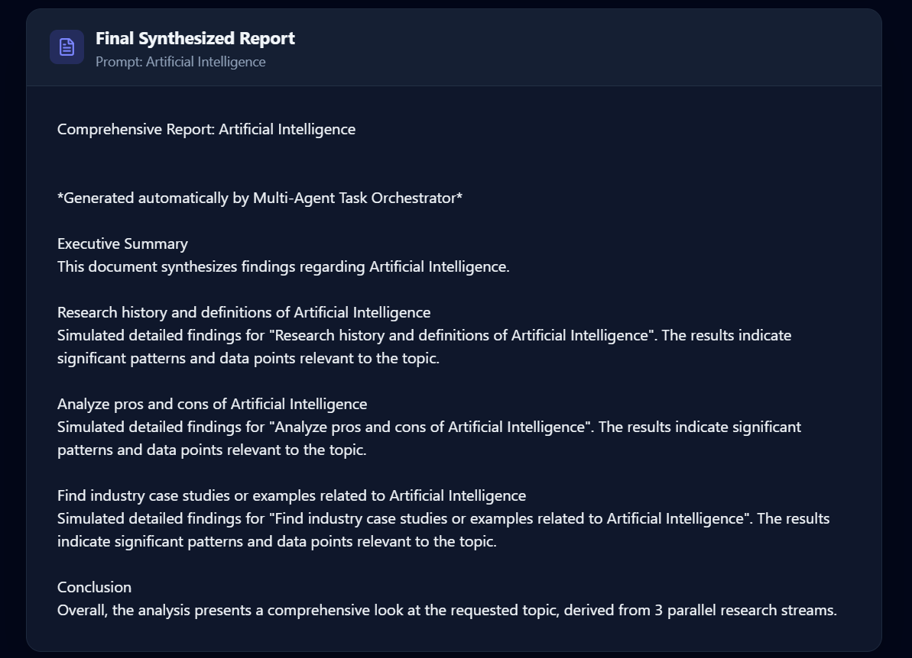
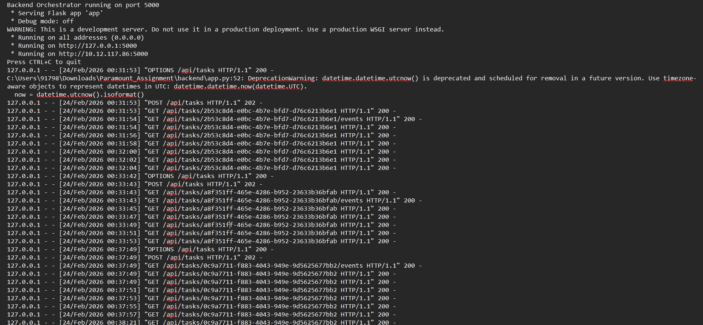
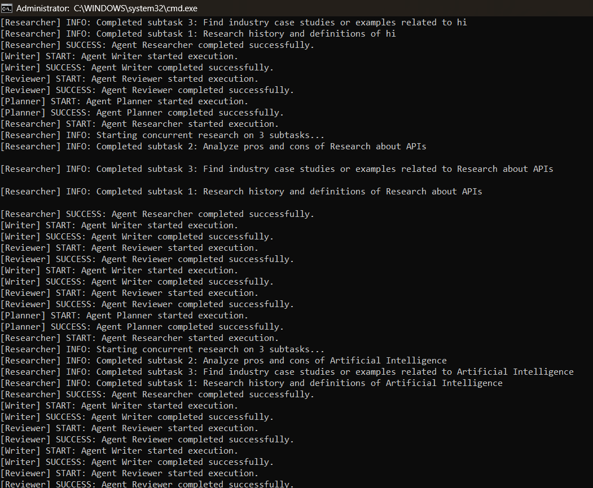
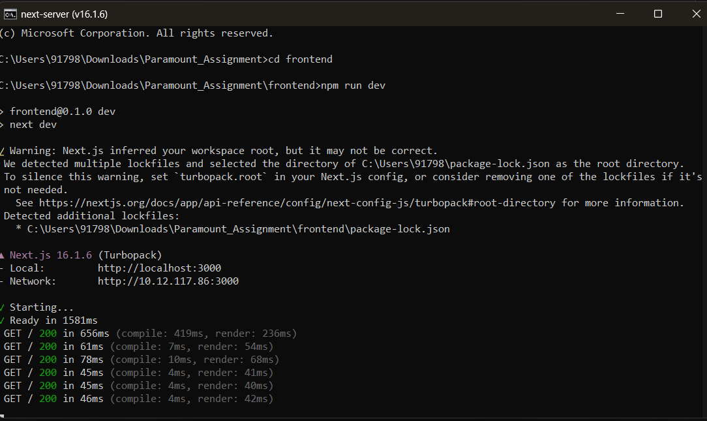

# 🤖 Multi-Agent Task Orchestration System

> A lightweight platform where multiple simulated AI agents collaborate to complete a complex research task — built for the **Paramount Take-Home Assignment**.

**Tech Stack:** Node.js · Express · Next.js · TypeScript · Server-Sent Events · Jest

---

## 📸 Screenshots

### Entry / Home Screen



### Active Agent Pipeline Visualizer



### Planner Agent



### Researcher Agent



### Reviewer Agent



### Writer Agent



### Final Report Output



### Backend Terminal – Startup



### Backend Terminal – In Progress



### Frontend Terminal



---

## ✨ Features & Stretch Goals Completed

| Feature                                                                            | Status |
| ---------------------------------------------------------------------------------- | ------ |
| **Multi-Agent Pipeline** (Planner → Researcher → Reviewer → Writer)                | ✅     |
| **Parallel Sub-tasks** – Researcher uses `Promise.all` for concurrent research     | ✅     |
| **Retry / Error Handling** – `BaseAgent` retries with exponential backoff          | ✅     |
| **Real-Time Updates** – Server-Sent Events (SSE) stream progress live to the UI    | ✅     |
| **Agent Configuration** – Toggle the Reviewer Agent on/off from the UI             | ✅     |
| **Persistent State** – JSON file store survives server restarts                    | ✅     |
| **Unit Tests** – Jest tests validate Orchestrator logic, retries & config skipping | ✅     |

---

## 🏗️ Architecture Overview

```
┌─────────────────────────────────────────────────────┐
│                  Next.js Frontend                   │
│   (Pipeline Visualizer · Report View · Config UI)   │
└───────────────────────┬─────────────────────────────┘
                        │  REST POST + SSE GET
┌───────────────────────▼─────────────────────────────┐
│               Node.js / Express Backend              │
│  ┌───────────────────────────────────────────────┐  │
│  │              TaskOrchestrator                 │  │
│  │  Planner → Researcher (parallel) → Reviewer  │  │
│  │                      → Writer                │  │
│  └───────────────────────────────────────────────┘  │
│  ┌───────────────┐  ┌──────────────────────────┐    │
│  │  BaseAgent    │  │  JSON File (db/index.ts)  │    │
│  │  (retry/log)  │  │  Persistent Event Store   │    │
│  └───────────────┘  └──────────────────────────┘    │
└─────────────────────────────────────────────────────┘
```

See [DESIGN.md](DESIGN.md) for the full architectural rationale and trade-off analysis.

---

## 🚀 Getting Started

### Prerequisites

- **Node.js** v18+
- **npm**

### 1. Clone the repository

```bash
git clone https://github.com/nagakoushik24/Multi-Agent-Task-Orchestrator-Assignment.git
cd Multi-Agent-Task-Orchestrator-Assignment
```

### 2. Start the Backend

```bash
cd backend
npm install
npm run dev
```

> Backend runs on **http://localhost:3001**

### 3. Start the Frontend

Open a **new terminal**:

```bash
cd frontend
npm install
npm run dev
```

> Frontend runs on **http://localhost:3000**

---

## 🎮 Usage

1. Open **http://localhost:3000** in your browser.
2. Enter a research prompt — e.g., _"Research the pros and cons of microservices"_.
3. Toggle the **Reviewer Agent** on or off using the configuration switch.
4. Click **"Execute Pipeline"**.
5. Watch the **real-time visualizer** as agents start, occasionally simulate retries, and pass data down the pipeline.
6. The final compiled **Markdown report** appears when the pipeline is complete.

---

## 🧪 Running Tests

```bash
cd backend
npm test
```

Jest unit tests cover:

- Orchestrator happy-path execution
- Retry logic with exponential backoff
- Config-based agent skipping (Reviewer disabled)

---

## 📁 Project Structure

```
.
├── assets/               # 📷 Screenshots used in this README
├── backend/
│   ├── src/
│   │   ├── agents/       # PlannerAgent, ResearcherAgent, ReviewerAgent, WriterAgent
│   │   ├── core/         # TaskOrchestrator, BaseAgent
│   │   ├── db/           # JSON persistence layer
│   │   └── routes/       # Express routes (tasks, SSE)
│   └── tests/            # Jest unit tests
├── frontend/
│   └── src/
│       ├── app/          # Next.js App Router pages
│       └── components/   # PipelineVisualizer, ReportView, etc.
├── DESIGN.md             # Architectural decisions & trade-offs
└── README.md             # This file
```


